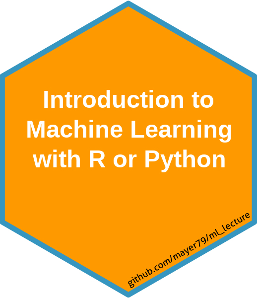

# Introduction to Machine Learning<a href='https://github.com/mayer79/ml_lecture'></a>

#### Michael Mayer

## Overview

Welcome to this training course on machine learning (ML). 
It is both available in R and Python.

ML can be viewed as a collection of statistical algorithms used to

1. predict values (supervised ML) or to
2. investigate data structure (unsupervised ML).

Our focus is on *supervised ML*. Depending on if we predict numbers or classes, we talk about *regression* or *classification*.

## Copyright

This lecture is being distributed under the [creative commons license](https://creativecommons.org/licenses/by/2.0/).

## How to cite?

Michael Mayer. Introduction to Machine Learning (2024). Web: https://github.com/mayer79/ml_lecture/

## Organization

The lecture is split into four chapters, each of which is accompanied with an R/Python notebook. You will find them in the corresponding subfolders.

1. Basics and Linear Models 
    - Basics
    - Linear regression
    - Generalized Linear Model
2. Model Selection and Validation
3. Trees
    - Decision trees
    - Random forests
    - Gradient boosting
4. Neural Nets

Each chapter will take us about two hours and is accompanied by exercises.

You can preview the html outputs of the R lecture by clicking on these links:

1. [Basics and Linear Models](https://mayer79.github.io/ml_lecture/1_Basics_and_Linear_Models.html)
2. [Model Selection and Validation](https://mayer79.github.io/ml_lecture/2_Model_Selection_and_Validation.html)
3. [Trees](https://mayer79.github.io/ml_lecture/3_Trees.html)
4. [Neural Nets](https://mayer79.github.io/ml_lecture/4_Neural_Nets.html)

The Python notebooks can be viewed directly on Github in the "py" folder.

## Prerequisites

In order to be able to follow the lecture, you should be familiar with

- Descriptive statistics
- Linear regression
- R or Python

To get the lecture notes both as html and code-notebooks, clone this repository by running 

```
git clone https://github.com/mayer79/ml_lecture.git
```

### Software for the Python version of the lecture

Python 3.11 and the packages specified [here](py/requirements.txt).

### Software for the R version of the lecture

- R version >= 4.1
- These packages:
    - tidyverse
    - FNN
    - withr
    - rpart.plot
    - ranger
    - xgboost
    - keras
    - hstats
    - MetricsWeighted
    - insuranceData
    - lightgbm

For the last chapter, we will use Python with TensorFlow >= 2.15. You can install it by running the R command `keras::install_keras(version = "release-cpu")`. If the following code works, you are all set. (Some red start-up messages/warnings are okay.)

```
library(tensorflow)
tf$constant("Hello Tensorflow!")
```

## Optional Topics to Discuss

- Basics and Linear Models: random effects; penalized regression
- Model Selection and Validation: is it always necessary?
- Trees: supervised clustering; SHAP; interaction constraints, interaction strength
- Neural Nets: transfer learning; PyTorch; image data; autoencoders
- General: distribution of predictions; quantile regression; when is overfitting (un-)problematic?
- XAI: How to use insights from complex ML model to improve GLM?

## Further Reading

- James, G., Witten, D., Hastie, T., Tibshirani, R. (2013). *An Introduction to Statistical Learning - with Applications in R*. New York: Springer.
- James, G., Witten, D., Hastie, T., Tibshirani, R., Taylor, J. (2023). *An Introduction to Statistical Learning - with Applications in Python*. New York: Springer.
- Hastie, T., Tibshirani, R., Friedman, J. (2001). *The Elements of Statistical Learning: Data Mining, Inference, and Prediction*. New York: Springer.
- Wickham, H., Grolemund, G. (2017). *R for Data Science: Import, Tidy, Transform, Visualize, and Model Data*. O'Reilly Media. 
- VanderPlas, J. (2016). *Python data science handbook : essential tools for working with data*. O'Reilly Media.
- Chollet, F. (2017). *Deep Learning with Python*. Manning Publications Co.
- Chollet, F., Allaire, J. J. (2018). *Deep Learning with R*. Manning Publications Co.


