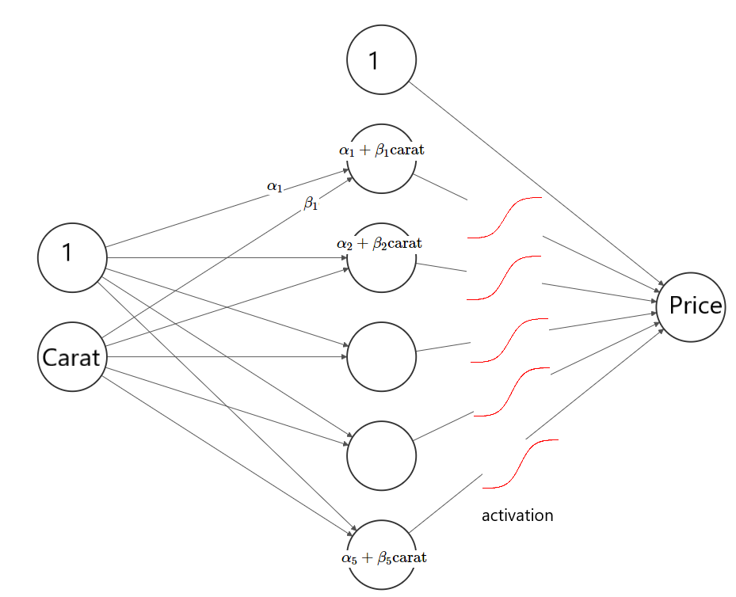
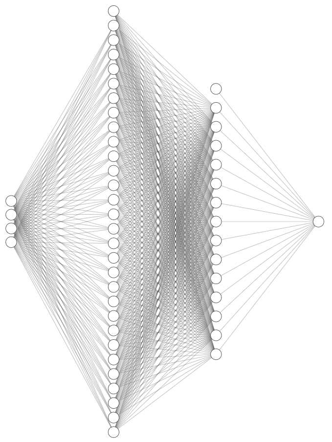

```{r setup, include=FALSE}
knitr::opts_chunk$set(echo = TRUE, warning = FALSE, message = FALSE)
```

# Introduction

Artificial neural nets are extremely versatile and powerful. They can be used to

1. **fit simple models like GLMs**,
2. **learn interactions and transformations in an automatic way (like tree-based methods)**,
3. fit data much larger than RAM (e.g. images),
4. learn "online" (update the model with additional data),
5. fit multiple response variables at the same time,
6. model input of dimension higher than two (e.g. images, videos),
7. model input of *different* input dimensions (e.g. text and images),
8. fit data with sequential structure in both in- and output (e.g. a text translator),
9. model data with spatial structure (images), and
10. fit models with many millions of parameters.

In this chapter, we will mainly deal with the first two aspects. Since a lot of new terms are being used, we have collected a glossary in the last section.

# Basics and linear models

Let us revisit the simple linear regression
$$
  E(\text{price}) = \alpha + \beta \cdot \text{carat}.
$$
In Chapter 1 we have found the solution $\hat\alpha = -2256.36$ and $\hat \beta = 7756.43$ by ordinary least-squares.

Above situation can be viewed as a neural network with

- an input layer having two nodes (`carat` and the intercept called "bias" with value 1),
- a "fully connected" (= "dense") output layer with one node (`price`). Fully connected means that each node of a layer is a linear function of all node values of the previous layer. Each linear function has parameters or network *weights* that need to be estimated. In our case just $\alpha$ and $\beta$.

Visualized, the situation looks as follows.


*Part of the figures were done with this cool [webtool](http://alexlenail.me/NN-SVG/index.html).*

We want to show that the parameters estimated by such neural network will be quite similar to the ones learned by linear least-squares. To do so, we will use Google's [TensorFlow](https://www.tensorflow.org/) with its convenient [Keras](https://keras.io/) interface. 

## Example: simple linear regression
```{r, cache=TRUE}
library(ggplot2)
library(keras)
# use_python(path to python...)

# RMSE metric needs to be defined "by hand"
metric_rmse <- custom_metric("rmse", function(y_true, y_pred) {
  sqrt(k_mean(k_square(y_true - y_pred)))
})

# input layer: we have 1 covariable
input <- layer_input(shape = 1)

# Output layer directly connects to the input layer. There are no hidden layers.
output <- input %>%
  layer_dense(units = 1, activation = 'linear')

# Create and compile model
nn <- keras_model(inputs = input, outputs = output)
# summary(nn)
nn %>% compile(
  optimizer = optimizer_adam(lr = 1),
  loss = 'mse',
  metrics = metric_rmse
)

# Fit model - naive without validation
history <- nn %>% fit(
  x = diamonds$carat,
  y = diamonds$price,
  epochs = 30,
  batch_size = 100
)

plot(history, metrics = "rmse")

unlist(get_weights(nn))

# Plot effect of carat on average price
x <- seq(0.3, 3, by = 0.1)
plot(x, predict(nn, x), type = "b", xlab = "carat", ylab = "price")
```

Indeed: the solution of the tiny neural network is quite similar to the OLS solution. 

# The optimization algorithm

Neural nets are fitted by **stochastic gradient descent (SGD)**. It works as follows:

1. Initiate the parameters with random values around 0. 
2. Forward step: Use the parameters to predict all observations in a *batch*. A batch is a randomly selected subset of the full data set. This makes the algorithm "stochastic".
3. Backpropagation: Change the parameters in the right direction, making the loss on the current batch smaller. This involves calculating derivatives ("gradients") of the loss function (e.g. MSE) with respect to all parameters.
4. Repeat Steps 2-3 until one *epoch* is over, i.e. each observation appeared in a batch.
5. Repeat Step 4 for multiple epochs until the parameter estimates stabilize or validation performance stops improving.

In our simple example above, the derivatives can be easily calculated. The more layers a network has (see below), the more complex it gets to calculate derivatives of the loss with respect to each weight. TensorFlow is an "auto-differentiator". It calculates all symbolic derivatives in the `compile` step.

# Hidden layers

Our first neural network above consisted of only an input and an output layer. By adding one or more *hidden* layers between in- and output, the network gains additional parameters, i.e. more flexibility. The nodes of a hidden layer can be viewed as derived variables, representing the original covariables. Their values are sometimes called *embedding* or *encoding*. The closer a layer is to the output, the better its nodes are suitable to predict the response variable. In this way, a neural network finds the right transformations and interactions of its covariables in an automatic way. The only ingredience is a large data set and a flexible enough network "architecture" (number of layers, nodes per layer). 

Neural nets with more than one hidden layer are called "deep neural nets".

We will now add a hidden layer with five nodes to our simple linear regression network. The architecture now looks as follows:


This network has 16 parameters (why?). How much better than our simple network with just two parameters will it be?

## Example: linear regression with hidden layer (I)
```{r, cache=TRUE}
library(ggplot2)
library(keras)
# use_python(path to python...)

# RMSE metric needs to be defined "by hand"
metric_rmse <- custom_metric("rmse", function(y_true, y_pred) {
  sqrt(k_mean(k_square(y_true - y_pred)))
})

# Input layer: we have 1 covariable
input <- layer_input(shape = 1)

# One hidden layer
output <- input %>%
  layer_dense(units = 5, activation = 'linear') %>% 
  layer_dense(units = 1, activation = 'linear')

# Create and compile model
nn <- keras_model(inputs = input, outputs = output)
# summary(nn)
nn %>% compile(
  optimizer = optimizer_adam(lr = 1),
  loss = 'mse',
  metrics = metric_rmse
)

# Fit model - naive without validation
nn %>% fit(
  x = diamonds$carat,
  y = diamonds$price,
  epochs = 30,
  batch_size = 100
)

# Plot effect of carat on average price
x <- seq(0.3, 3, by = 0.1)
plot(x, predict(nn, x), type = "b", xlab = "carat", ylab = "price")

```

Oops, it seems as if the extra hidden layer had no effect. The reason is that a linear function of a linear function is still a linear function. Adding the hidden layer did not really change the model.

# Activation functions

The missing magic component is the so called [*activation* function](https://en.wikipedia.org/wiki/Activation_function) after each layer, which transforms the values of the nodes. So far, we have used "linear activations", which - in neural network slang - is just the identity function. 

The activation of the *output* layer has the same purpose as the inverse of the link function of a corresponding GLM. It maps predictions to the scale of the response: 

- linear regression -> linear activation
- binary logistic regression -> sigmoid activation
- multinomial logistic regression -> softmax activation
- log-linear regression -> exponential activation

For other layers, the purpose of the activation function is a different one: thanks to being non-linear, it adds small amounts of interactions and non-linearity. Typical activation functions are

- the hyperbolic tangent ("S"-shaped function that maps real values to $[-1, 1]$),
- the sigmoidal function ("S"-shaped function that maps real values to $[0, 1]$),
- the linear rectangular unit "ReLU" $f(x) = \text{max}(0, x)$ that sets negative values to 0.

Let's add to the last example a non-linear activation after the hidden layer.



## Example: linear regression with hidden layer (II)
```{r, cache=TRUE}
library(ggplot2)
library(keras)
# use_python(path to python...)

# RMSE metric needs to be defined "by hand"
metric_rmse <- custom_metric("rmse", function(y_true, y_pred) {
  sqrt(k_mean(k_square(y_true - y_pred)))
})

# Input layer: we have 1 covariable
input <- layer_input(shape = 1)

# One hidden layer
output <- input %>%
  layer_dense(units = 5, activation = 'tanh') %>% 
  layer_dense(units = 1, activation = 'linear')

# Create and compile model
nn <- keras_model(inputs = input, outputs = output)

nn %>% compile(
  optimizer = optimizer_adam(lr = 0.2),
  loss = 'mse',
  metrics = metric_rmse
)

# Fit model - naive without validation
nn %>% fit(
  x = diamonds$carat,
  y = diamonds$price,
  epochs = 50,
  batch_size = 100
)

# Plot effect of carat on average price
x <- seq(0.3, 3, by = 0.1)
plot(x, predict(nn, x), type = "b", xlab = "carat", ylab = "price")

```

Adding the non-linear activation after the hidden layer has changed the model. The effect of carat is now better representing the association between carat and price.

# Practical considerations

## Validation

So far, we have naively fitted the neural networks without splitting the data for test and validation. Don't do this! Usually, one sets a small test dataset (e.g. 10% of rows) aside to assess the final model performance and a validaton dataset for model tuning. 

In order to choose the main tuning parameters, namely

- network architecture,
- activation functions,
- learning rate, 
- batch size, and
- number of epochs, 

one uses a simple validation approach as cross-validation takes too much time.

## Missing values

A neural net does not accept missing values in the input. They need to be filled first (often by a typical value or a value below the minimal non-missing value (e.g. -1)).

## Input standardization

Stochastic gradient descent starts by random initialization of parameters. This step is optimized for standardized input. Standardization has to be done manually by either

- min/max scale the values of each input to the range -1 to 1,
- standard scale the values of each input to mean 0 and standard deviation 1, or
- use relative ranks.

Note that the scaling transformation is *calculated* on the training data and then *applied* to the validation and test data. This usually requries a couple of lines of code.

## Categorical input

There are three ways to represent categorical input variables. 

1. Binary and ordinal categoricals are best represented by integers and then treated as numeric.
2. Unordered categoricals are either one-hot-encoded (i.e. each category is represented by binary variable) or 
3. they are represented by an input embedding. With an embedding, the categories are integer encoded and then compressed by a special *embedding layer* to a few (usually 1 or 2) dense features. This requires a more complex network architecture but saves a lot of memory and preprocessing. This approach is heavily used when the input consists of words (which is a categorical variable with thousands of levels - one level per word).

For Option 2, input standardization is not required, for Option 3 it *must* not be applied as the embedding layer expects integers.

## Callbacks

Sometimes, we want to do stuff during training, e.g.

- stop training when validation performance starts worsening,
- reduce the learning rate when the network seems to be stuck in a "plateau", or
- save the network weights between epochs.

Such monitoring tasks are added by *callbacks*. We will see them in action in the example below.

## Types of layers

So far, we have encountered only dense (=fully connected layers) and activation layers. Here some further types:

- Embedding layers to represent integer encoded unordered categoricals.
- Dropout layers to add regularization.
- Convolution and pooling layers for image data.
- Recurrent layers (long-short-term memory LSTM, gated recurrent unit GRU) for sequence data.
- Concatenation layers to combine different branches of the network (like in a directed graph).
- Flatten layers to bring higher dimensional layers to dimension 1 (e.g. for emeddings, image and text data).

## Optimizer

Pure stochastic gradient descent is rarely applied. Usually, one works with variants that e.g. try to avoid being stuck in local minima. Modern optimizers are "adam", "nadam" and "RMSProp". They work usually out-of-the-box, except for the learning rate, which has to be manually chosen.

## Custom losses and metrics

Using TensorFlows backend functions, one can define its own metrics (see example above for the root-mean-squared error) and loss functions.

## Overfitting and regularization

Like with linear models, a model with too many parameters will overfit in an undesired amount. With about 50 to 100 observations per parameter, overfitting is usually unproblematic. (For image and text data, different rules apply). As with penalized regression or trees, there are ways to actively reduce effects of overfitting in neural nets. The two main options are

- pull the parameters of a layer towards zero by L1 and/or L2 penalties,
- add dropout layers. A dropout layer randomly sets node values of the previous layer to 0, switching them off. This is an elegant way to fight overfitting not unlike bagging.

## Choosing the architecture

How many layers and number of nodes per layer to select? For tabular data, using 1-3 hidden layers is usually enough. If we start with $m$ input variabels, the number of nodes in the first hidden layer is usually higher than $m$ and reduces for later layers. There should not be a "representational bottleneck", i.e. an early hidden layer with too few parameters. 

The number of parameters should not be too high compared to the number of rows, see "Overfitting and regularization" above. 

## Interpretation

Variable importance of covariables in neural networks can be assessed by permutation importance (how much performance is lost when shuffling column X?) or SHAP importance. Covariable effects are studies by partial or SHAP dependence plots.

# Example: diamonds

We will now fit a neural net with two hidden layers (30 and 15 nodes) and a total of 631 parameters. Learning rate and batch size were chosen by validation data. The number of epochs is chosen by an early stopping callback.



```{r, cache=TRUE}
library(ggplot2)
library(dplyr)
library(tidyr)
library(keras)
# use_python(path to python...)

# RMSE metric needs to be defined "by hand"
metric_rmse <- custom_metric("rmse", function(y_true, y_pred) {
  sqrt(k_mean(k_square(y_true - y_pred)))
})

# Response and covariables
y <- "price"
x <- c("carat", "color", "cut", "clarity")

# Split into train and validation
library(splitTools)
ix <- partition(diamonds[[y]], p = c(train = 0.8, valid = 0.2), seed = 9838)

train <- diamonds[ix$train, ]
valid <- diamonds[ix$valid, ]

y_train <- train[[y]]
y_valid <- valid[[y]]

X_train <- train[, x]
X_valid <- valid[, x]

# Standardize X using X_train
sc <- list(
  center = attr(scale(data.matrix(X_train)), "scaled:center"),
  scale = attr(scale(data.matrix(X_train)), "scaled:scale")
)

# Function that maps data.frame to scaled network input
prep_nn <- function(X, x = c("carat", "color", "cut", "clarity"), scaling = sc) {
  X <- data.matrix(X[, x, drop = FALSE])
  scale(X, center = scaling$center, scale = scaling$scale)
}

# Input layer: we have 4 covariables
input <- layer_input(shape = 4)

# Three hidden layers with contracting number of nodes
output <- input %>%
  layer_dense(units = 30, activation = 'relu') %>% 
  layer_dense(units = 15, activation = 'relu') %>% 
  layer_dense(units = 1, activation = 'linear')

# Create and compile model
nn <- keras_model(inputs = input, outputs = output)
summary(nn)
nn %>% compile(
  optimizer = optimizer_adam(lr = 0.3),
  loss = 'mse',
  metrics = metric_rmse
)

# Callbacks
cb <- list(
  callback_early_stopping(patience = 20),
  callback_reduce_lr_on_plateau(patience = 5)
)
       
# Fit model - naive without validation
history <- nn %>% fit(
  x = prep_nn(X_train),
  y = y_train,
  epochs = 100,
  batch_size = 400, 
  validation_data = list(prep_nn(X_valid), y_valid),
  callbacks = cb
)

history$metrics[c("rmse", "val_rmse")] %>% 
  data.frame() %>% 
  mutate(epoch = row_number()) %>% 
  pivot_longer(cols = c("rmse", "val_rmse")) %>% 
ggplot(aes(x = epoch, y = value, group = name, color = name)) +
  geom_line(size = 1.4)

# Interpret
library(flashlight)
library(MetricsWeighted)

fl <- flashlight(model = nn, 
                 y = "price", 
                 data = diamonds[ix$valid, ], 
                 label = "nn", 
                 metrics = list(rmse = rmse, `R squared` = r_squared),
                 predict_function = function(m, X) predict(m, prep_nn(X), batch_size = 1000))

# Performance on validation data
plot(light_performance(fl), fill = "orange")

# Permutation importance
plot(light_importance(fl, v = x), fill = "orange")

# Partial dependence plots
plot(light_profile(fl, v = "carat", n_bins = 40)) +
  labs(title = "Partial dependence plot for carat", y = "price")

plot(light_profile(fl, v = "clarity")) +
  labs(title = "Partial dependence plot for clarity", y = "price")

plot(light_profile(fl, v = "cut")) +
  labs(title = "Partial dependence plot for cut", y = "price")

plot(light_profile(fl, v = "color")) +
  labs(title = "Partial dependence plot for color", y = "price")

```

# Example: Embeddings (optional)

Representing categorical input variables through embedding layers is extremely useful in practice. We will thus end this chapter with an example on how to do it. This example also shows how flexible neural network structures are.

```{r, cache=TRUE}
library(ggplot2)
library(dplyr)
library(tidyr)
library(keras)
library(splitTools)
library(insuranceData)
data(dataCar)

# use_python(path to python...)

# Response and covariables
y <- "clm"
x_emb <- "veh_body"
x_dense <- c("veh_value", "veh_age", "gender", "area", "agecat")
x <- c(x_dense, x_emb)

# Split into train and validation
ix <- partition(dataCar[[y]], p = c(train = 0.8, valid = 0.2), seed = 9838)

train <- dataCar[ix$train, ]
valid <- dataCar[ix$valid, ]

y_train <- train[[y]]
y_valid <- valid[[y]]

X_train <- train[, x]
X_valid <- valid[, x]

# Standardize X using X_train
sc <- list(
  center = attr(scale(data.matrix(X_train[, x_dense])), "scaled:center"),
  scale = attr(scale(data.matrix(X_train[, x_dense])), "scaled:scale")
)

# Function that maps data.frame to scaled network input (a list with a dense part 
# and each embedding as separat integer vector)
prep_nn <- function(X, dense = x_dense, emb = x_emb, scaling = sc) {
  X_dense <- data.matrix(X[, dense, drop = FALSE])
  X_dense <- scale(X_dense, center = scaling$center, scale = scaling$scale)
  emb <- lapply(X[emb], function(x) as.integer(x) - 1)
  c(list(dense1 = X_dense), emb)
}

# Inputs
input_dense <- layer_input(shape = length(x_dense), name = "dense1")
input_veh_body <- layer_input(shape = 1, name = "veh_body")

# Embedding of veh_body
emb_veh_body <- input_veh_body %>% 
  layer_embedding(input_dim = nlevels(dataCar$veh_body) + 1, 
                  output_dim = 1) %>% 
  layer_flatten()

# Combine dense input and embedding
outputs <- list(input_dense, emb_veh_body) %>% 
      layer_concatenate() %>% 
      layer_dense(30, activation = "tanh") %>% 
      layer_dense(1, activation = "sigmoid")

# Input
inputs <- list(dense1 = input_dense, 
               veh_body = input_veh_body)

# Create and compile model
nn <- keras_model(inputs = inputs, outputs = outputs)
summary(nn)
nn %>% compile(
  optimizer = optimizer_adam(lr = 0.0001),
  loss = 'binary_crossentropy'
)

# Callbacks
cb <- list(
  callback_early_stopping(patience = 20),
  callback_reduce_lr_on_plateau(patience = 5)
)
       
# Fit model - naive without validation
history <- nn %>% fit(
  x = prep_nn(X_train),
  y = y_train,
  epochs = 100,
  batch_size = 400, 
  validation_data = list(prep_nn(X_valid), y_valid),
  callbacks = cb
)

history$metrics[c("loss", "val_loss")] %>% 
  data.frame() %>% 
  mutate(epoch = row_number()) %>% 
  pivot_longer(cols = c("loss", "val_loss")) %>% 
ggplot(aes(x = epoch, y = value, group = name, color = name)) +
  geom_line(size = 1.4)

# Interpret
library(flashlight)
library(MetricsWeighted)

fl <- flashlight(model = nn, 
                 y = y, 
                 data = dataCar[ix$valid, ], 
                 label = "nn", 
                 metrics = list(logLoss = logLoss, `R squared` = r_squared_bernoulli),
                 predict_function = function(m, X) predict(m, prep_nn(X), batch_size = 1000))

# Performance on validation data
plot(light_performance(fl), fill = "orange")

# Permutation importance
plot(light_importance(fl, v = x), fill = "orange")

# Partial dependence
plot(light_profile(fl, v = "veh_value", n_bins = 40)) +
  labs(title = "Partial dependence plot for veh_value", y = "price")

plot(light_profile(fl, v = "veh_body"), rotate_x = TRUE) +
  labs(title = "Partial dependence plot for veh_body", y = "price")

plot(light_profile(fl, v = "area")) +
  labs(title = "Partial dependence plot for area", y = "price")

plot(light_profile(fl, v = "agecat")) +
  labs(title = "Partial dependence plot for agecat", y = "price")

```

# Task

1. Fit diamond prices by gamma loss with log-link, using the custom loss function defined below. Tune the model to achieve good performance.
```{r}
loss_gamma <- function(y_true, y_pred) {
  -k_log(y_true / y_pred) + y_true / y_pred
}
```
2. Study either the optional claims data example or make your own neural net models predicting claim yes/no. For simplicity, you can represent the categorical feature `veh_body` by integers.

# Neural network slang

Here, we summarize some of the neural network slang.

- Activation (function): The transformation applied on the node values.
- Architecture: The layout of layers and nodes per layer.
- Batch: A couple of rows of the full training data used for one stochastic gradient descent update.
- Callback: An action to be taken depending during training, e.g. saving weights, reducing learning rate or stop training.
- Epoch: The process of updating the network weights by stochastic gradient descent until each observation in the training set was used once.
- Embedding/Encoding: The node values (e.g. of the last hidden layer).
- Keras: User-friendly layer over TensorFlow.
- Layer: Main organization unit of a neural network.
- Learning rate: Controls the step size of SGD, i.e. how aggressive the network learns.
- Node: Nodes on the input layer are the covariables, nodes on the output layer the response and nodes on a hidden layer are latent variables representing the covariables for the task to predict the response.
- Optimizer: The specific variant of SGD.
- Stochastic gradient descent (SGD): The optimization algorithm of standard neural networks.
- TensorFlow: An important implementation of neural networks.
- Weights: The parameters of a neural net.