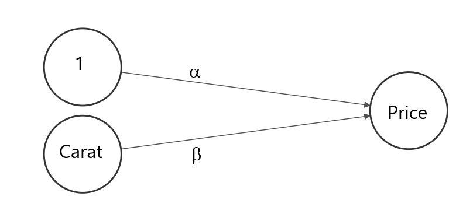
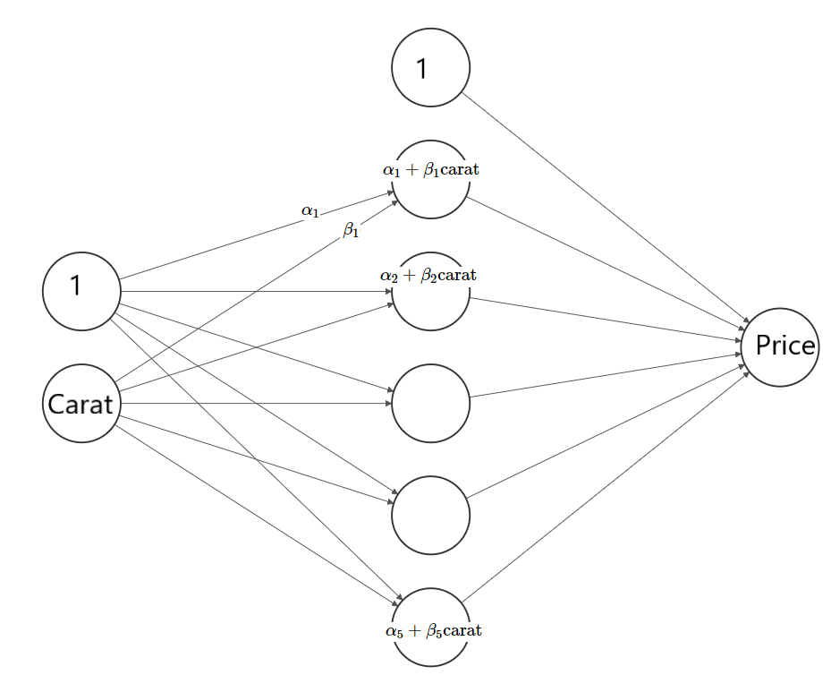

```{r setup, include=FALSE}
knitr::opts_chunk$set(echo = TRUE)
```

# Introduction

Artificial neural nets are extremely versatile and powerful. They can be used to

1. **fit simple models like GLMs**,
2. **learn interactions and transformations in an automatic way (like tree-based methods)**,
3. fit data much larger than RAM (e.g. images),
4. learn "online" (update the model with additional data),
5. fit multiple response variables at the same time,
6. model input of dimension higher than two (e.g. images, videos),
7. model input of *different* input dimensions (e.g. text and images),
8. fit data with sequential structure in both in- and output (e.g. a text translator),
9. model data with spatial structure (images), and
10. fit models with many millions of parameters.

In this chapter, we will deal with the first two aspects.

# Basics and linear models

Let us revisit the simple linear regression
$$
  E(\text{price}) = \alpha + \beta \cdot \text{carat}.
$$
In Chapter 1 we have found the solution $\hat\alpha = -2256.36$ and $\hat \beta = 7756.43$ by ordinary least-squares.

Above situation can be viewed as a neural network with

- an input layer having two nodes (`carat` and the intercept called "bias" with value 1),
- a "fully connected" output layer with one node (`price`). Fully connected means that each node of a layer is a linear function of all node values of the previous layer. Each linear function has parameters or network *weights* that need to be estimated. In our case just $\alpha$ and $\beta$.



*Part of the figures were done with this cool [webtool](http://alexlenail.me/NN-SVG/index.html).*

We want to show that the parameters estimated by the neural network will be quite similar to the ones learned by linear least-squares. To do so, we will use Google's [TensorFlow](https://www.tensorflow.org/) with its convenient [Keras](https://keras.io/) interface. 

## Example: simple linear regression
```{r, cache=TRUE}
library(ggplot2)
library(keras)
# use_python(path to python...)

# RMSE metric needs to be defined "by hand"
metric_rmse <- custom_metric("rmse", function(y_true, y_pred) {
  sqrt(k_mean(k_square(y_true - y_pred)))
})

# input layer: we have 1 covariable
input <- layer_input(shape = 1)

# Output layer directly connects to the input layer. There are no hidden layers.
output <- input %>%
  layer_dense(units = 1, activation = 'linear')

# Create and compile model
nn <- keras_model(inputs = input, outputs = output)
# summary(nn)
nn %>% compile(
  optimizer = optimizer_adam(lr = 1),
  loss = 'mse',
  metrics = metric_rmse
)

# Fit model - naive without validation
history <- nn %>% fit(
  x = diamonds$carat,
  y = diamonds$price,
  epochs = 30,
  batch_size = 100
)

plot(history, metrics = "rmse")

unlist(get_weights(nn))

# Plot effect of carat on average price
x <- seq(0.3, 3, by = 0.1)
plot(x, predict(nn, x), type = "b", xlab = "carat", ylab = "price")
```

Indeed: the solution of the tiny neural network is quite similar to the OLS solution. 

# Hidden layers

Our first neural network above consisted of only an input and an output layer. By adding one or more *hidden* layers between in- and output, the network gains additional parameters, i.e. more flexibility. The nodes of a hidden layer can be viewed as derived variables, representing the original covariables. Their values are sometimes called *embedding* or *encoding*. The closer a layer is to the output, the better its nodes are suitable to predict the response variable. In this way, a neural network finds the right transformations and interactions of its covariables in an automatic way. The only ingredience is a large data set and a flexible enough network "architecture" (number of layers, nodes per layer). 

We will now add a hidden layer with five nodes to our simple linear regression network. The architecture looks as follows:



This network has 16 parameters (why?). Will it be more or less accurate than the simple network with just two parameters? In order to not fall in the overfitting trap, we use a 20% validation set.

## Example: linear regression with hidden layer (I)
```{r, cache=TRUE}
# Code continued from above 

# Input layer: we have 1 covariable
input <- layer_input(shape = 1)

# One hidden layer
output <- input %>%
  layer_dense(units = 5, activation = 'linear') %>% 
  layer_dense(units = 1, activation = 'linear')

# Create and compile model
nn <- keras_model(inputs = input, outputs = output)
# summary(nn)
nn %>% compile(
  optimizer = optimizer_adam(lr = 1),
  loss = 'mse',
  metrics = metric_rmse
)

# Fit model - naive without validation
nn %>% fit(
  x = diamonds$carat,
  y = diamonds$price,
  epochs = 30,
  batch_size = 100, 
  validation_data = valid
)

# Plot effect of carat on average price
x <- seq(0.3, 3, by = 0.1)
plot(x, predict(nn, x), type = "b", xlab = "carat", ylab = "price")

```
Oops, it seems as if the extra hidden layer had no effect. The reason is that a linear function of a linear function is still a linear function. Adding the hidden layer did not really change the model.

# Activation functions

The missing magic component is the so called *activation* function after each layer, which transforms the values of the nodes. So far, we have used "linear activations", which - in neural network slang - is just the identity function. 

The activation of the *output* layer has the same purpose as the inverse of the link function of a corresponding GLM. It maps predictions to the scale of the response: 

- linear regression -> linear activation
- binary logistic regression -> sigmoid activation
- multinomial logistic regression -> softmax activation
- log-linear regression -> exponential activation

After all other layers, the purpose of the activation function is a different one: thanks to being non-linear, it adds small amounts of interactions and non-linearities that can be picked up by the neural net. Typical activation functions are

- the hyperbolic tangent ("S"-shaped function that maps real values to $[-1, 1]$),
- the sigmoidal function ("S"-shaped function that maps real values to $[0, 1]$),
- the linear rectangular function "relu" $f(x) = \text{max}(0, x)$ that sets negative values to 0. Often used for large neural networks to save computational resources.

Let's add to the last example a non-linear activation after the hidden layer.

## Example: linear regression with hidden layer (II)
```{r, cache=TRUE}
# Input layer: we have 1 covariable
input <- layer_input(shape = 1)

# One hidden layer
output <- input %>%
  layer_dense(units = 5, activation = 'tanh') %>% 
  layer_dense(units = 1, activation = 'linear')

# Create and compile model
nn <- keras_model(inputs = input, outputs = output)

nn %>% compile(
  optimizer = optimizer_adam(lr = 0.2),
  loss = 'mse',
  metrics = metric_rmse
)

# Fit model - naive without validation
nn %>% fit(
  x = diamonds$carat,
  y = diamonds$price,
  epochs = 50,
  batch_size = 100
)

# Plot effect of carat on average price
diamonds %>% 
  transform(prediction = predict(nn, carat, batch_size = 1000)) %>% 
ggplot(aes(x = carat, y = price)) +
  geom_smooth() +
  geom_line(aes(y = prediction))

```

# How it works

Neural nets are fitted by **stochastic gradient descent (SGD)**. It works as follows:

1. Initiate the parameters with random values around 0. 
2. Forward step: Use the parameters to predict all observations in a *batch*. A batch is a randomly selected subset of the full data set. This makes the algorithm "stochastic".
3. Backpropagation: Change the parameters in the right direction, i.e. to make the loss on the current batch smaller. This involves calculating derivatives ("gradients") of the loss function (e.g. MSE) with respect to all parameters.
4. Repeat Steps 2-3 until one *epoch* is over, i.e. each observation was used in a batch.
5. Repeat Step 4 for multiple epochs until the parameter estimates stabilize or validation performance stops improving.

For *deep* neural nets, i.e. nets with multiple hidden layers, Step 3 requires differentiation of deep compositions of linear and non-linear functions. This is the reason why frameworks like TensorFlow or PyTorch are called "auto-differentiators". In TensorFlow, it is the `compile` step that calculates all the symbolic derivatives for all parameters of the model.

```{r, cache=TRUE}
library(splitTools)
# Split into train and test
ix <- partition(diamonds$price, p = c(train = 0.8, test = 0.2), seed = 9838)

# Input layer: we have 1 covariable
input <- layer_input(shape = 1)

# One hidden layer
output <- input %>%
  layer_dense(units = 5, activation = 'tanh') %>% 
  layer_dense(units = 1, activation = 'linear')

# Create and compile model
nn <- keras_model(inputs = input, outputs = output)
# summary(nn)
nn %>% compile(
  optimizer = optimizer_adam(lr = 0.3),
  loss = 'mse',
  metrics = metric_rmse
)

# Fit model - naive without validation
history <- nn %>% fit(
  x = diamonds$carat[ix$train],
  y = diamonds$price[ix$train],
  epochs = 100,
  batch_size = 1000, 
  validation_data = list(diamonds$carat[ix$test], diamonds$price[ix$test]),
  callbacks = callback_early_stopping(patience = 5)
)

# Plot effect of carat on average price
x <- seq(0.3, 3, by = 0.1)
plot(x, predict(nn, x), type = "b", xlab = "carat", ylab = "price")

```

